# 🚀 MERN Food Delivery App Deployment on AWS ECS Fargate

A complete production-style deployment of a **MERN Stack Food Delivery Application** using **Docker, Amazon ECS Fargate, Amazon ECR, Application Load Balancer (ALB), VPC, IAM Roles, CloudWatch, and MongoDB Atlas**.

---

# 📌 Project Overview

This project demonstrates how to deploy a containerized MERN application on AWS using:

- Dockerized frontend and backend applications
- Amazon ECS Fargate for container orchestration
- Amazon ECR for storing Docker images
- Application Load Balancer for routing traffic
- MongoDB Atlas as cloud database
- CloudWatch for monitoring and logging

---

# 🛠️ Tech Stack

| Category | Technology |
|---|---|
| Frontend | React.js |
| Backend | Node.js, Express.js |
| Database | MongoDB Atlas |
| Containerization | Docker |
| Container Registry | Amazon ECR |
| Orchestration | Amazon ECS Fargate |
| Load Balancer | Application Load Balancer (ALB) |
| Monitoring | CloudWatch |
| Networking | VPC |
| Security | IAM Roles & Security Groups |

---

# 🏗️ Architecture

```text
User
   ↓
Application Load Balancer (ALB)
   ↓
Amazon ECS Fargate Services
   ↓
Docker Containers
   ↓
MongoDB Atlas
```

---

# 📸 Architecture Diagram


---

# 🚀 Deployment Steps

---

# Step 1 — Build Docker Images

## Frontend

```bash
cd frontend
docker build -t frontend-app .
```

## Backend

```bash
cd backend
docker build -t backend-node .
```

---

# Step 2 — Create Amazon ECR Repositories

Created two repositories:

- frontend-app
- backend-node

---

# 📸 Amazon ECR Repositories

## 1. Create Frontend and Backend Repo
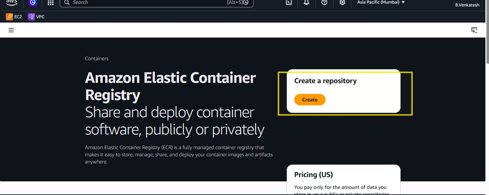

## 2. Created Repositories for frontend and Backend

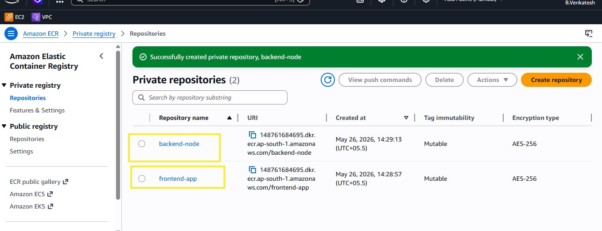

# ECR Repositories image tags

## 1. Frontend repo image
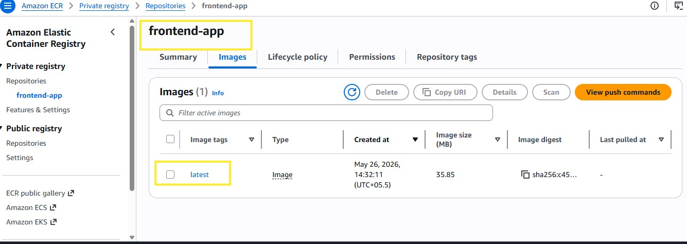

## 2. Backend repo image
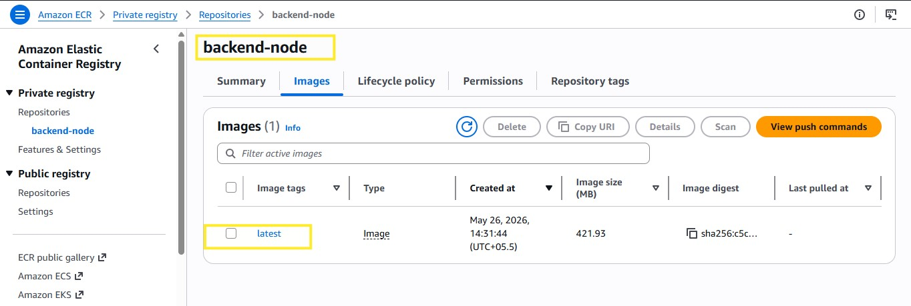

---

# Step 3 — Login to Amazon ECR

```bash
aws ecr get-login-password --region ap-south-1 | docker login --username AWS --password-stdin <ACCOUNT_ID>.dkr.ecr.ap-south-1.amazonaws.com
```

---

# Step 4 — Tag Docker Images

## Frontend

```bash
docker tag frontend-app:latest <ACCOUNT_ID>.dkr.ecr.ap-south-1.amazonaws.com/frontend-app
```

## Backend

```bash
docker tag backend-node:latest <ACCOUNT_ID>.dkr.ecr.ap-south-1.amazonaws.com/backend-node
```

---

# Step 5 — Push Docker Images to Amazon ECR

## Frontend

```bash
docker push <ACCOUNT_ID>.dkr.ecr.ap-south-1.amazonaws.com/frontend-app
```

## Backend

```bash
docker push <ACCOUNT_ID>.dkr.ecr.ap-south-1.amazonaws.com/backend-node
```
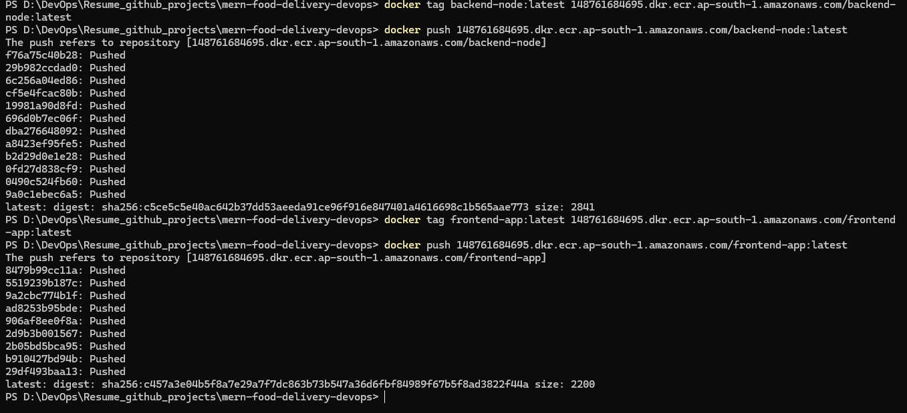
---

# ☁️ ECS Cluster Setup

Created ECS Cluster using Fargate launch type.

| Configuration | Value |
|---|---|
| Cluster Name | mern-cluster |
| Launch Type | Fargate |
| Region | ap-south-1 |

---

# 📸 ECS Cluster

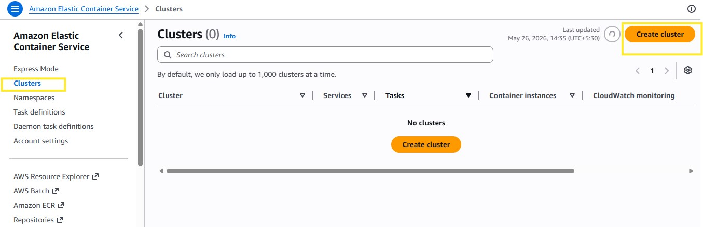


---

# 📦 ECS Task Definitions

Created separate task definitions for:

- Frontend Container
- Backend Container

## Frontend Task Definition

| Setting | Value |
|---|---|
| Launch Type | Fargate |
| Container Port | 80 |
| CPU | 0.25 vCPU |
| Memory | 0.5 GB |

---

## Backend Task Definition

| Setting | Value |
|---|---|
| Launch Type | Fargate |
| Container Port | 5000 |
| CPU | 0.25 vCPU |
| Memory | 0.5 GB |

---

# 📸 ECS Task Definitions

## 1. Create Task definitions

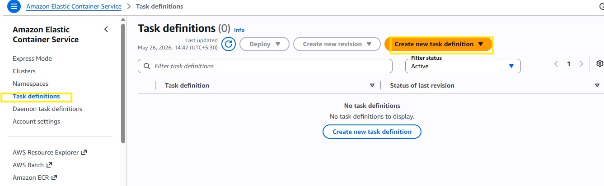

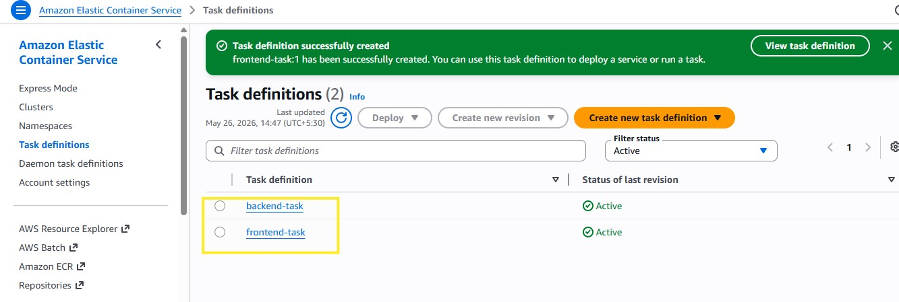

## 2. Frontend Task Definations

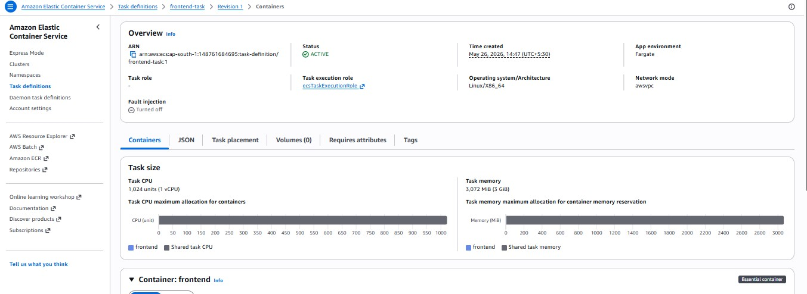

## 3. Backend Task Definations
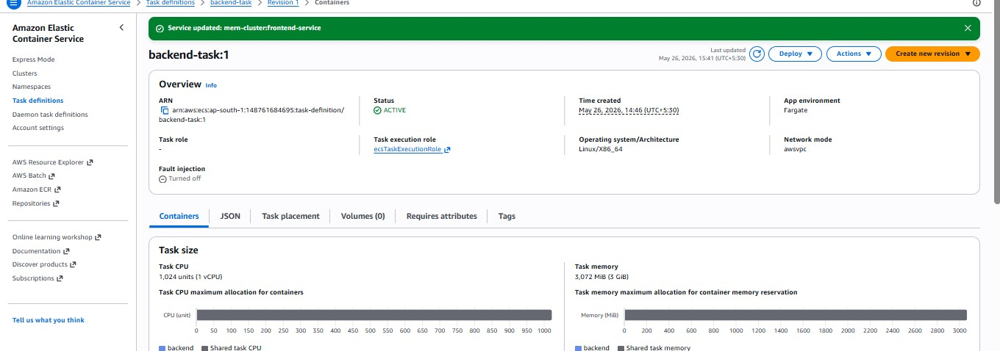

---

# 🌐 ECS Services

Created ECS services to manage application containers.

## Responsibilities

- Maintain desired task count
- Restart failed containers automatically
- Register tasks with ALB
- Handle deployments

---

# 📸 ECS Services

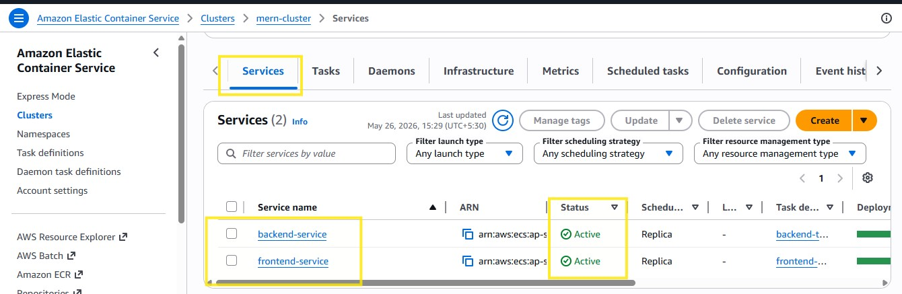

# 📸 Running ECS Tasks


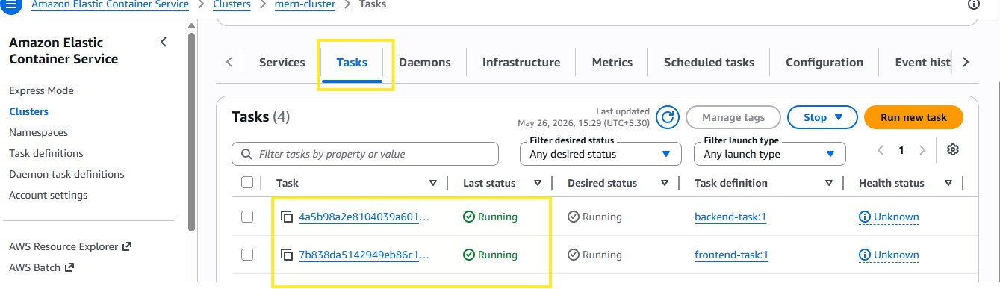
---

# ⚖️ Application Load Balancer (ALB)

Created an internet-facing Application Load Balancer.

| Setting | Value |
|---|---|
| Name | mern-alb |
| Type | Application |
| Scheme | Internet-facing |

---

# 📸 Application Load Balancer


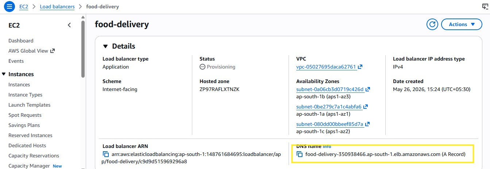


---

# 🎯 Target Group

Created target group for ECS services.

| Setting | Value |
|---|---|
| Name | frontend-tg |
| Protocol | HTTP |
| Port | 80 |
| Target Type | IP |

Health checks configured successfully.

---

# 📸 Target Group

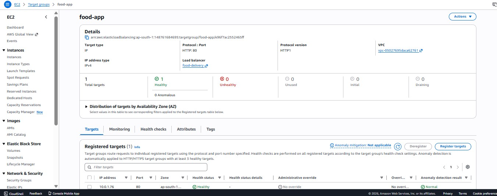

---

# 🔐 Security Configuration

## ALB Security Group

| Type | Port | Source |
|---|---|---|
| HTTP | 80 | 0.0.0.0/0 |

---

## ECS Task Security Group

| Type | Port | Source |
|---|---|---|
| HTTP | 80 | ALB Security Group |
| Custom TCP | 5000 | ALB Security Group |

---

# 📊 CloudWatch Monitoring

Used Amazon CloudWatch for:

- ECS container logs
- Application monitoring
- Troubleshooting deployment issues
- Task debugging

---

# 🌍 Application URL

Application successfully deployed using ALB DNS:

```bash
http://food-delivery-350938466.ap-south-1.elb.amazonaws.com
```

---

# 📸 Application UI


---

# ✅ Features Implemented

- Dockerized MERN application
- Amazon ECS Fargate deployment
- Amazon ECR integration
- Application Load Balancer configuration
- MongoDB Atlas integration
- CloudWatch monitoring
- Secure networking using VPC & IAM
- Production-style deployment architecture

---

# 📚 Learning Outcomes

Through this project, I learned:

- Docker containerization
- ECS Fargate deployment
- Amazon ECR image management
- Application Load Balancer configuration
- ECS task & service management
- CloudWatch monitoring
- Cloud networking & security
- Production deployment troubleshooting

---

# 👨‍💻 Author

**Boda Venkatesh**

DevOps Engineer | AWS | Docker | Kubernetes | CI/CD | Azure

```